## Azure Infrastructure

- Azure Iot Hub
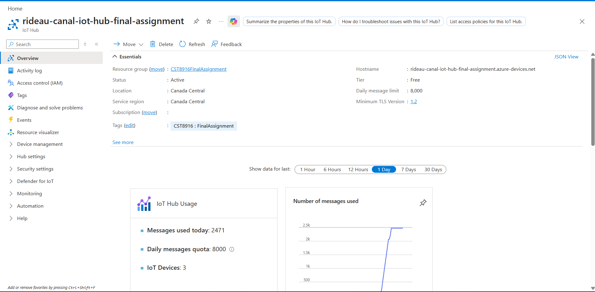

- Azure IoT Hub Devices
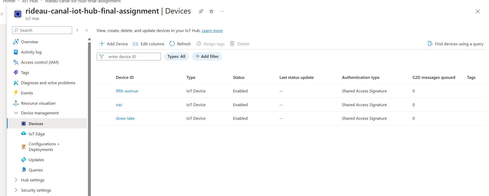

- Azure Cosmos DB
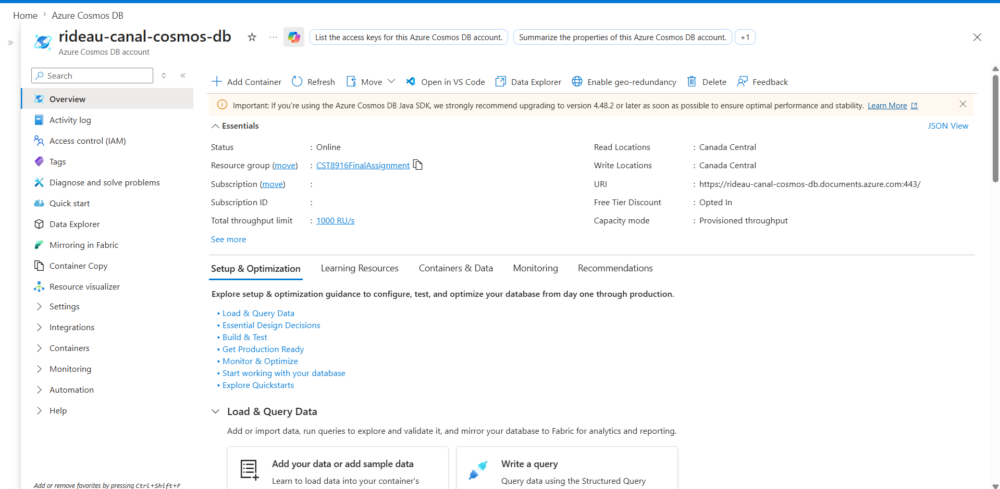

- Azure Cosmos DB Database
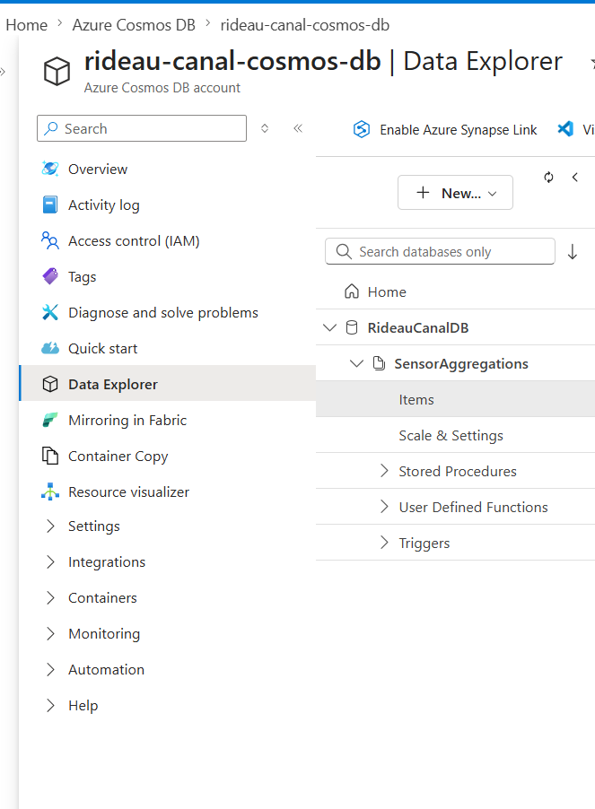

- Storage Account
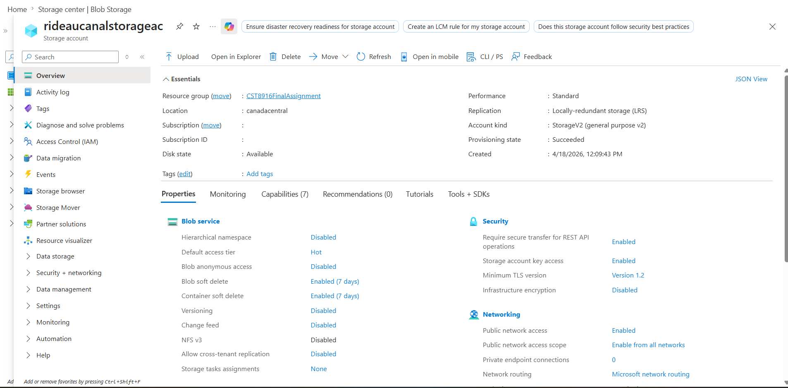

- Azure Storage Account Container
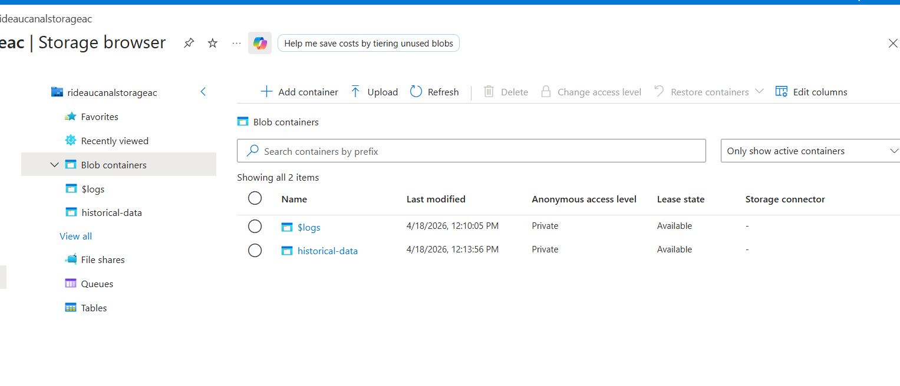

- Azure Stream Anlytics
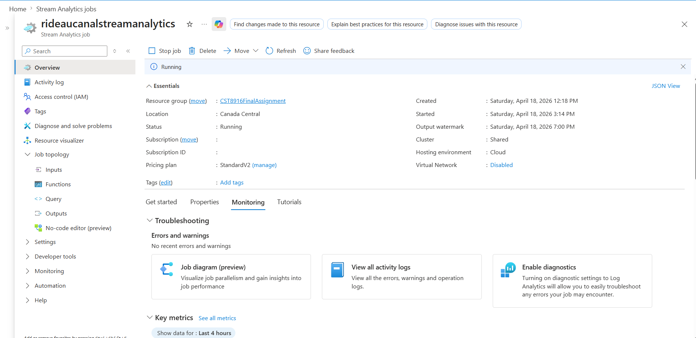

- Azure Stream Anlytics Input
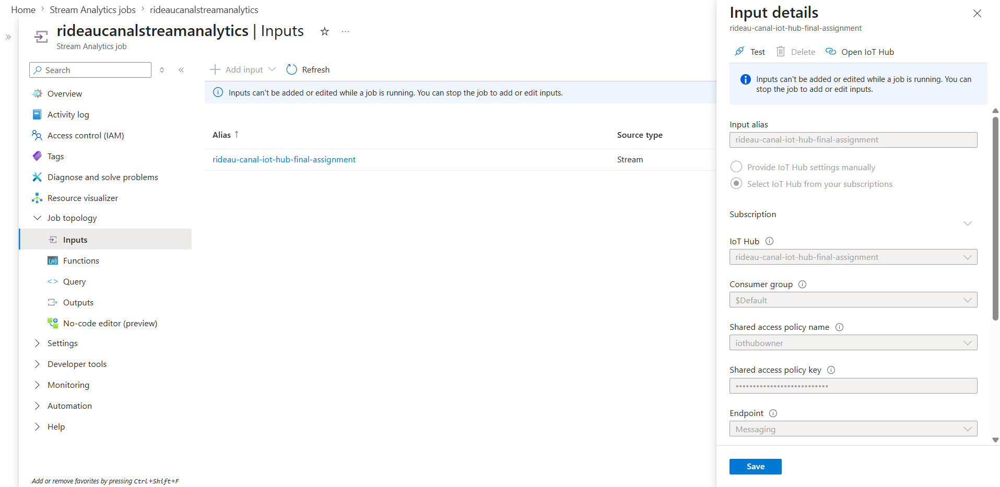

- Azure Stream Anlytics Query
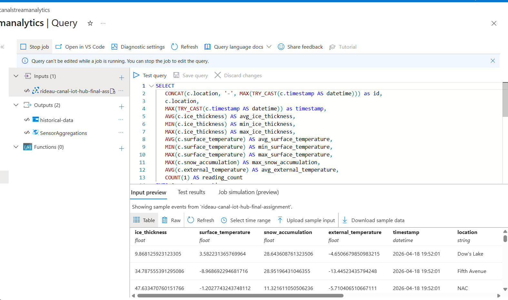

- Azure Stream Outputs
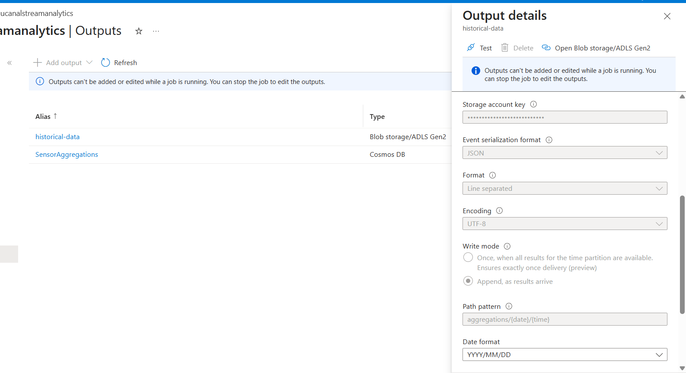

- Azure Stream Anlytics
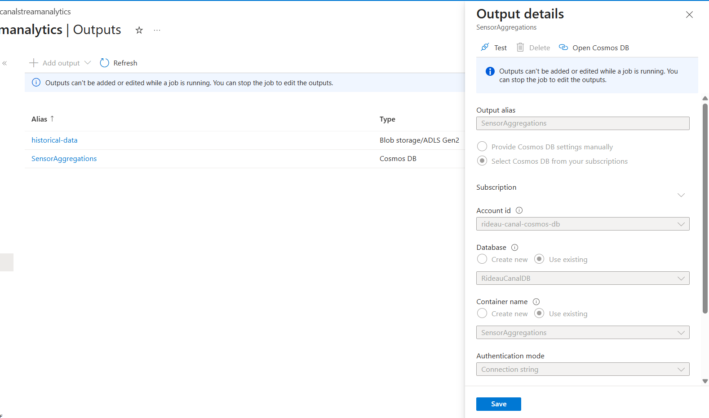

- Azure App Services
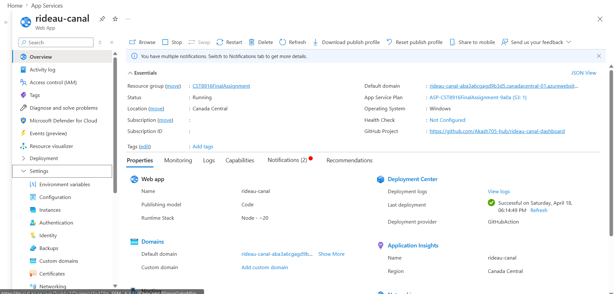

## Running Application

- Dashboard
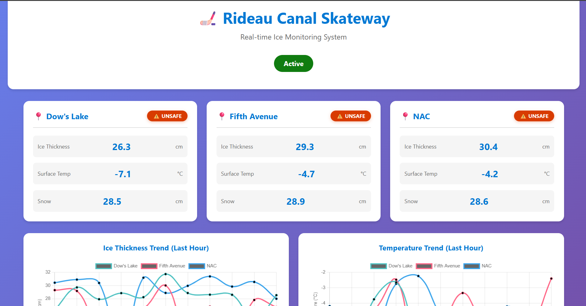
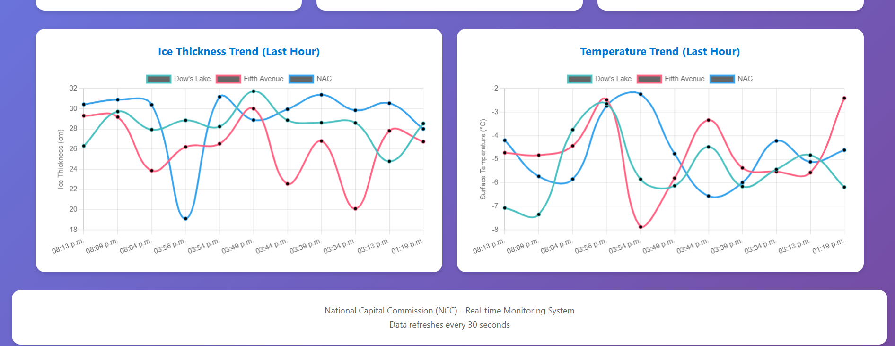

- IOT Hub
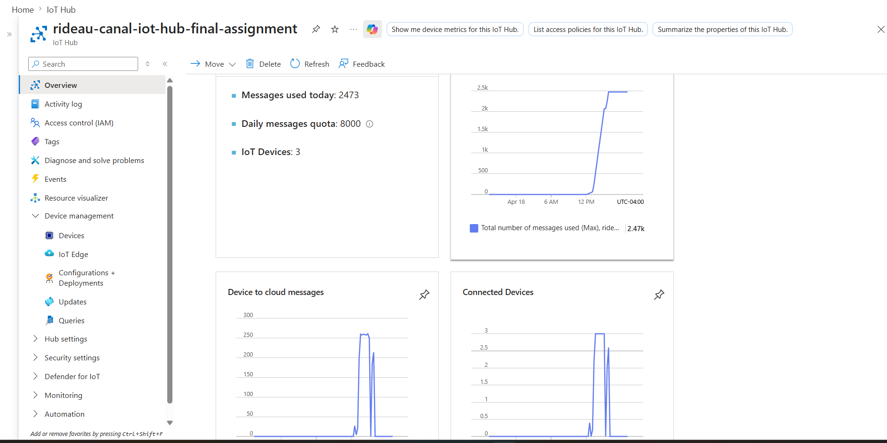

- Stream Analytics Metrics 
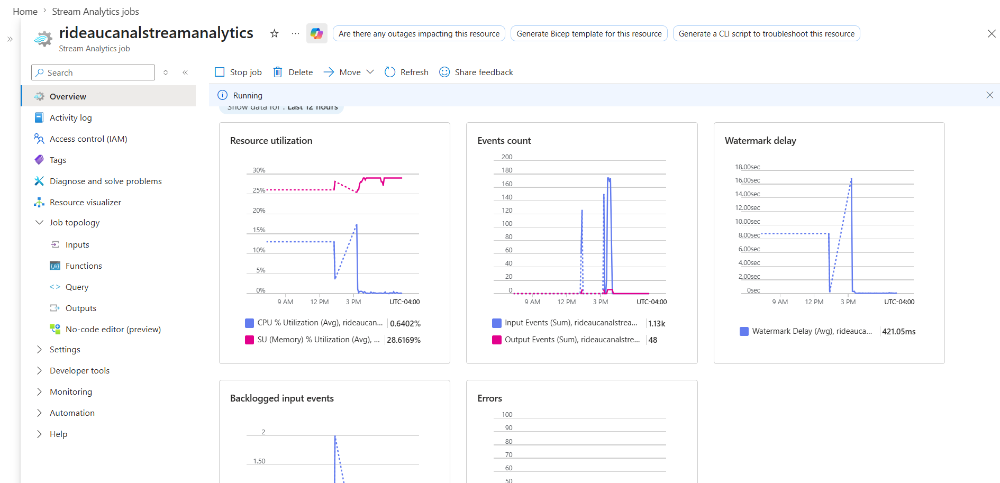

- Storage Blob JSON
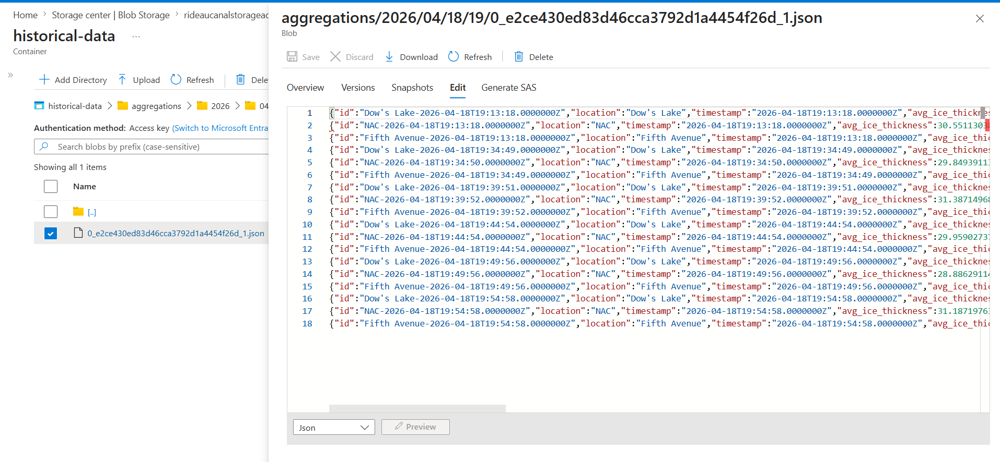

- Cosmos Db
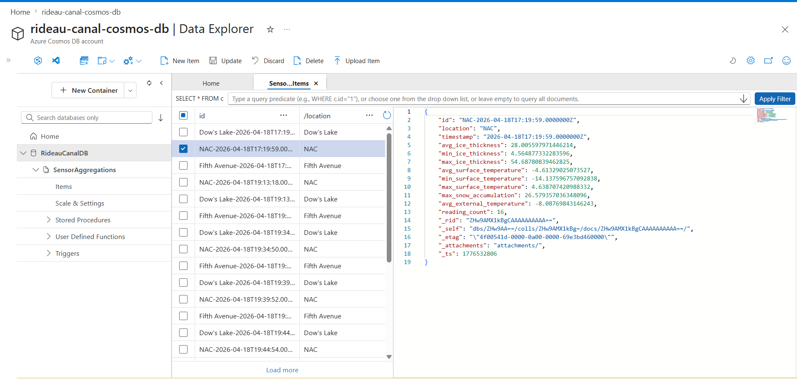

